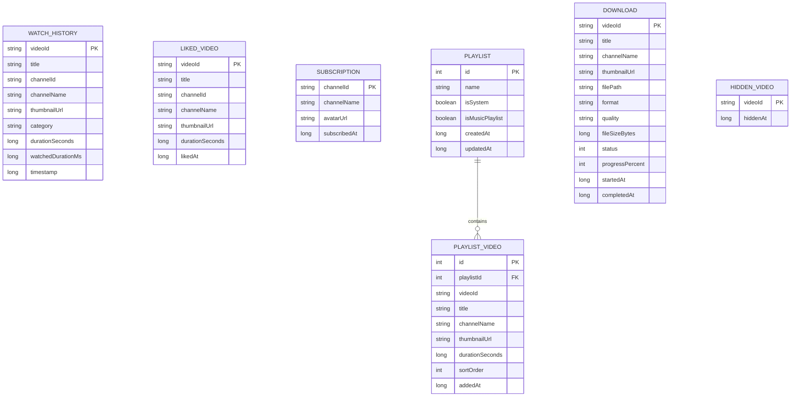

# MyTube v2.0 — Product Requirements Document (PRD)

> **Mode**: ralph | **Gate**: team-plan → team-prd | **Status**: PLANNING PHASE

---

## 1. Executive Summary

MyTube v2.0 transforms the current minimal streaming client into a full-featured, privacy-first YouTube alternative. All user data (likes, subscriptions, playlists, watch history) is stored **locally on-device** using Room DB — no Google account required. The upgrade spans 9 feature pillars across 5 implementation phases.

---

## 2. Current State Assessment

### What exists (27 Kotlin files)
| Layer | Status | Key Files |
|-------|--------|-----------|
| **Data/Remote** | ✅ Working | `InvidiousApiClient`, `InnerTubeClient`, `NewPipeDownloader` |
| **Repository** | ✅ Working | `CascadingYouTubeRepository` (NewPipe → Invidious → InnerTube → Fake) |
| **Domain Model** | ⚠️ Minimal | `Video`, `Channel`, `StreamInfo`, `SearchResult` |
| **Playback** | ✅ Working | `PlaybackService` (Media3 + MediaSession), `PlayerViewModel` |
| **UI** | ⚠️ Single screen | `HomeScreen`, `FullPlayer`, `MiniPlayer`, `VideoCard` |
| **Navigation** | ❌ None | Single-activity, no navigation graph |
| **Local Storage** | ❌ None | No Room DB, no DataStore, no cache |
| **Gestures** | ❌ None | Basic click-only interaction |

### Dependencies already in version catalog (but unused)
- `androidx.room` (2.8.4) — declared but not wired
- `androidx.datastore-preferences` (1.2.1) — declared but not wired
- `androidx.work-runtime-ktx` (2.11.2) — declared but not wired
- `reorderable` (3.1.0) — declared but not wired

---

## 3. Feature Pillars & Requirements

### PILLAR 1: Smart Recommendation Engine 🧠
**Goal**: Homepage shows personalized, non-repeating video suggestions

| ID | Requirement | Priority |
|----|-------------|----------|
| REC-01 | Hybrid recommendation: trending + category affinity + watch history signals | P0 |
| REC-02 | De-duplication: never show the same video ID twice in a single feed render | P0 |
| REC-03 | Seed from `WatchHistory` table: extract top 3 categories from last 50 watched videos | P0 |
| REC-04 | Mix ratio: 40% trending, 30% related-to-last-watched, 20% subscribed channels, 10% explore | P1 |
| REC-05 | Refresh feed on pull-down without full re-fetch (shuffle + inject new) | P1 |
| REC-06 | "Not Interested" action per video → blacklist videoId in `HiddenVideos` table | P2 |

**Algorithm (local, no server)**:
```
1. Fetch trending (Invidious/NewPipe)
2. Query local WatchHistory → extract top categories & channels
3. For each top category, fire search query → collect candidate pool
4. For each subscribed channel, fetch latest videos
5. Merge pools → de-duplicate by videoId → score by recency + diversity
6. Paginate 20 items at a time with infinite scroll
```

### PILLAR 2: Playlists 📋
| ID | Requirement | Priority |
|----|-------------|----------|
| PL-01 | Create, rename, delete playlists stored in Room `Playlist` + `PlaylistVideo` tables | P0 |
| PL-02 | Add/remove videos to/from playlists from VideoCard long-press or FullPlayer action bar | P0 |
| PL-03 | Drag-to-reorder within playlist (using `reorderable` library) | P1 |
| PL-04 | Auto-generated "Watch Later" and "Favorites" playlists on first launch | P1 |
| PL-05 | Play playlist sequentially with queue management in PlayerViewModel | P0 |
| PL-06 | Shuffle play, repeat one, repeat all modes | P1 |

### PILLAR 3: App Settings ⚙️
| ID | Requirement | Priority |
|----|-------------|----------|
| SET-01 | Settings screen via DataStore Preferences | P0 |
| SET-02 | Theme: System/Light/Dark toggle | P0 |
| SET-03 | Default video quality: Auto/1080p/720p/480p/360p | P0 |
| SET-04 | Default playback speed: 0.5x/0.75x/1x/1.25x/1.5x/2x | P1 |
| SET-05 | Background playback toggle (audio-only when app minimized) | P0 |
| SET-06 | Auto-play next video toggle | P1 |
| SET-07 | Content language / region preference | P2 |
| SET-08 | Cache size limit (50MB/100MB/250MB/500MB/1GB/Unlimited) | P1 |
| SET-09 | Clear cache, clear watch history, clear search history buttons | P0 |
| SET-10 | About / Version info / Open Source Licenses | P2 |

### PILLAR 4: Likes & Subscriptions (Local) ❤️
| ID | Requirement | Priority |
|----|-------------|----------|
| LIK-01 | Like/Unlike video → stored in Room `LikedVideo` table | P0 |
| LIK-02 | "Liked Videos" virtual playlist accessible from Library screen | P0 |
| LIK-03 | Subscribe/Unsubscribe channel → stored in Room `Subscription` table | P0 |
| LIK-04 | "Subscriptions" feed: aggregate latest videos from all subscribed channels | P0 |
| LIK-05 | Subscription feed refresh via WorkManager periodic background sync (configurable interval) | P1 |
| LIK-06 | Channel page: show channel info + latest videos when channel avatar tapped | P1 |

### PILLAR 5: YouTube-Style Gestures 👆
| ID | Requirement | Priority |
|----|-------------|----------|
| GES-01 | **Double-tap left/right** half of player → seek ±10s (with ripple animation) | P0 |
| GES-02 | **Swipe down** on FullPlayer → collapse to MiniPlayer | P0 |
| GES-03 | **Swipe left** on MiniPlayer → dismiss/close | P1 |
| GES-04 | **Long-press** → 2x speed while held (speed indicator overlay) | P0 |
| GES-05 | **Vertical swipe left edge** → brightness control | P1 |
| GES-06 | **Vertical swipe right edge** → volume control | P1 |
| GES-07 | **Horizontal swipe** on seekbar → fine-grained seek with preview | P1 |
| GES-08 | **Pinch-to-zoom** → toggle fill/fit video scaling | P2 |

### PILLAR 6: Cache Management 📦
| ID | Requirement | Priority |
|----|-------------|----------|
| CAC-01 | Thumbnail cache via Coil disk cache with configurable max size | P0 |
| CAC-02 | Stream metadata cache (video info, stream URLs) with TTL in Room | P1 |
| CAC-03 | Cache size display in Settings | P0 |
| CAC-04 | One-tap "Clear Cache" with confirmation dialog | P0 |
| CAC-05 | LRU eviction policy when cache exceeds configured limit | P1 |

### PILLAR 7: Download Videos/Audio ⬇️
| ID | Requirement | Priority |
|----|-------------|----------|
| DL-01 | Download video (best quality mp4) to app-specific storage | P0 |
| DL-02 | Download audio-only (best quality m4a/webm) | P0 |
| DL-03 | Download progress notification via WorkManager + ForegroundService | P0 |
| DL-04 | Download queue management (pause, resume, cancel) | P1 |
| DL-05 | "Downloads" section in Library screen showing offline content | P0 |
| DL-06 | Play downloaded content offline (MediaItem from local file URI) | P0 |
| DL-07 | Delete downloaded content with storage reclaim | P0 |
| DL-08 | Quality selection dialog before download (720p/480p/360p/audio-only) | P1 |

### PILLAR 8: Audio Mode 🎧
| ID | Requirement | Priority |
|----|-------------|----------|
| AUD-01 | Background audio: continue playback when app goes to background | P0 |
| AUD-02 | Audio-only mode toggle in FullPlayer → switch to audio stream, release video decoder | P0 |
| AUD-03 | MediaSession notification with album art, play/pause, next, prev | P0 |
| AUD-04 | Lock screen controls via MediaSession (already partially implemented) | P1 |
| AUD-05 | Audio focus handling: duck/pause on incoming calls (already configured) | P0 |

### PILLAR 9: YouTube Music Mode 🎵
| ID | Requirement | Priority |
|----|-------------|----------|
| MUS-01 | "Music" tab in bottom navigation → music-focused feed | P0 |
| MUS-02 | Music search with `type=music` filter | P0 |
| MUS-03 | Music queue with Up Next list | P0 |
| MUS-04 | Music player UI: album art full-screen, lyrics placeholder, queue drawer | P1 |
| MUS-05 | Music mix: auto-play related music tracks after current ends | P1 |
| MUS-06 | Music playlists (reuses Playlist system with `isMusicPlaylist` flag) | P1 |

---

## 4. Architecture Plan

### 4.1 New Package Structure
```
vn.lobie.mytube/
├── data/
│   ├── local/
│   │   ├── db/
│   │   │   ├── MyTubeDatabase.kt          # Room DB
│   │   │   ├── dao/
│   │   │   │   ├── WatchHistoryDao.kt
│   │   │   │   ├── LikedVideoDao.kt
│   │   │   │   ├── SubscriptionDao.kt
│   │   │   │   ├── PlaylistDao.kt
│   │   │   │   ├── DownloadDao.kt
│   │   │   │   └── HiddenVideoDao.kt
│   │   │   └── entity/
│   │   │       ├── WatchHistoryEntity.kt
│   │   │       ├── LikedVideoEntity.kt
│   │   │       ├── SubscriptionEntity.kt
│   │   │       ├── PlaylistEntity.kt
│   │   │       ├── PlaylistVideoEntity.kt
│   │   │       ├── DownloadEntity.kt
│   │   │       └── HiddenVideoEntity.kt
│   │   └── prefs/
│   │       └── SettingsDataStore.kt        # DataStore Preferences
│   ├── remote/  (existing)
│   └── repository/  (existing + new)
│       └── RecommendationEngine.kt
├── domain/
│   ├── model/  (existing + extended)
│   │   ├── Playlist.kt
│   │   ├── Download.kt
│   │   └── UserPreferences.kt
│   └── repository/  (existing + extended)
│       ├── LocalRepository.kt
│       └── DownloadRepository.kt
├── playback/  (existing + extended)
│   └── DownloadService.kt
├── ui/
│   ├── navigation/
│   │   └── AppNavigation.kt               # Bottom nav + screens
│   ├── home/  (existing, enhanced with recommendations)
│   ├── player/  (existing, enhanced with gestures)
│   │   └── GestureHandler.kt
│   ├── library/
│   │   ├── LibraryScreen.kt               # Playlists, Downloads, History
│   │   ├── PlaylistDetailScreen.kt
│   │   └── DownloadsScreen.kt
│   ├── subscriptions/
│   │   └── SubscriptionsScreen.kt
│   ├── music/
│   │   ├── MusicScreen.kt
│   │   └── MusicPlayerUI.kt
│   ├── settings/
│   │   └── SettingsScreen.kt
│   ├── channel/
│   │   └── ChannelScreen.kt
│   └── components/  (existing + new)
│       ├── SwipeableVideoCard.kt
│       └── DownloadProgressIndicator.kt
└── worker/
    ├── DownloadWorker.kt                   # WorkManager download
    └── SubscriptionSyncWorker.kt           # Background sub refresh
```

### 4.2 Room Database Schema


### 4.3 Navigation Structure
```
BottomNavigation:
├── 🏠 Home (recommendation feed)
├── 🔔 Subscriptions (subscribed channel feed)  
├── 🎵 Music (YouTube Music mode)
├── 📚 Library (playlists, downloads, history, liked)
└── ⚙️ Settings
```

### 4.4 Key Technology Decisions

| Decision | Choice | Rationale |
|----------|--------|-----------|
| Local DB | Room 2.8.4 | Already in catalog, Kotlin-first, Flow support |
| Preferences | DataStore | Already in catalog, type-safe, coroutine-native |
| Downloads | WorkManager + ProgressiveDownloader | Survives process death, notification support |
| Navigation | Material3 BottomNavigation + NavHost | Standard M3 pattern, deep-link ready |
| Gestures | Compose `pointerInput` + `detectTapGestures` + `detectDragGestures` | No extra dependency |
| Reorderable | `sh.calvin.reorderable` (3.1.0) | Already in catalog, LazyList drag-and-drop |
| Background audio | MediaSessionService (existing) | Already works, just needs toggle |

---

## 5. Implementation Phases (ROADMAP)

### Phase 1: Foundation (Room DB + DataStore + Navigation) — Est. 3 sessions
> **Prerequisite for all other phases**

| Task ID | Description | Files | AC |
|---------|-------------|-------|----|
| F-01 | Add Room + DataStore + WorkManager + KSP to `build.gradle.kts` | `build.gradle.kts` | Compiles cleanly |
| F-02 | Create `MyTubeDatabase` with all 7 entity + DAO classes | `data/local/db/` | `@Database` annotated, version 1 |
| F-03 | Create `SettingsDataStore` wrapper for all preferences | `data/local/prefs/` | Read/write all SET-* keys |
| F-04 | Implement Bottom Navigation with 5 tabs | `ui/navigation/` | All tabs navigate, back stack preserved |
| F-05 | Migrate `MainActivity` to use NavHost | `MainActivity.kt` | Existing home+player still works |

### Phase 2: Local User Data (Likes, Subscriptions, Watch History) — Est. 2 sessions
| Task ID | Description | Files | AC |
|---------|-------------|-------|----|
| U-01 | Implement `WatchHistoryDao` + auto-record on playVideo() | `dao/`, `PlayerViewModel` | History appears in Library |
| U-02 | Implement Like/Unlike toggle in FullPlayer + MiniPlayer | `LikedVideoDao`, player UI | Heart icon toggles, persists |
| U-03 | Implement Subscribe/Unsubscribe on channel avatar | `SubscriptionDao`, UI | Bell icon toggles, persists |
| U-04 | Build Library screen with "History", "Liked", "Downloads" sections | `LibraryScreen.kt` | All sections render with data |
| U-05 | Build Subscriptions feed screen | `SubscriptionsScreen.kt` | Shows latest from all subs |

### Phase 3: Playlists + Recommendation Engine — Est. 2 sessions
| Task ID | Description | Files | AC |
|---------|-------------|-------|----|
| P-01 | Implement Playlist CRUD (create, rename, delete) | `PlaylistDao`, `PlaylistScreen` | CRUD works end-to-end |
| P-02 | Add/Remove video to playlist (long-press + action bar) | UI components | Sheet shows playlists, toggle works |
| P-03 | Playlist detail screen with drag-to-reorder | `PlaylistDetailScreen` | Reorder persists to DB |
| P-04 | Sequential playlist playback with queue | `PlayerViewModel` | Next/Prev in queue works |
| P-05 | Build `RecommendationEngine` with de-duplication | `RecommendationEngine.kt` | Feed shows mixed, no duplicates |
| P-06 | Wire recommendation into HomeScreen | `HomeViewModel` | Homepage shows personalized feed |

### Phase 4: Gestures + Player Enhancements — Est. 2 sessions
| Task ID | Description | Files | AC |
|---------|-------------|-------|----|
| G-01 | Double-tap seek ±10s with ripple animation | `FullPlayer.kt` | Visual feedback + seek works |
| G-02 | Long-press 2x speed (speed indicator overlay) | `FullPlayer.kt` | Speed changes, reverts on release |
| G-03 | Swipe-down to collapse, swipe-left to dismiss mini | Player UI | Gesture works naturally |
| G-04 | Vertical edge swipes for brightness/volume | `GestureHandler.kt` | Smooth, respects system limits |
| G-05 | Playback speed selector in FullPlayer | `FullPlayer.kt` | 0.5x–2x selection persists |
| G-06 | Settings screen with all SET-* preferences | `SettingsScreen.kt` | All toggles save to DataStore |

### Phase 5: Downloads + Audio Mode + Music — Est. 3 sessions
| Task ID | Description | Files | AC |
|---------|-------------|-------|----|
| D-01 | `DownloadWorker` with progress notification | `worker/`, `DownloadService` | Download completes, notification shows % |
| D-02 | Download dialog (quality selection) from FullPlayer | UI | Dialog shows available qualities |
| D-03 | Downloads screen with offline playback | `DownloadsScreen.kt` | Play downloaded file locally |
| D-04 | Cache management (size display, clear action) | `SettingsScreen` | Accurate size, clear works |
| D-05 | Audio-only mode toggle + background playback | `PlayerViewModel`, `PlaybackService` | Audio continues in background |
| D-06 | Music tab with music-focused feed and search | `MusicScreen.kt` | Music feed renders, search filters |
| D-07 | Music player UI with queue management | `MusicPlayerUI.kt` | Album art view, Up Next drawer |

---

## 6. Acceptance Criteria Summary

| Pillar | Must-Pass Gate |
|--------|---------------|
| Recommendations | Feed renders 20+ unique videos with mix from trending + history signals |
| Playlists | Create playlist → add 3 videos → play sequentially → verify queue |
| Settings | Toggle dark mode → persists after restart; change quality → next video uses it |
| Likes/Subs | Like 2 videos → appear in Liked list; subscribe channel → feed shows their videos |
| Gestures | Double-tap seek works; long-press speed works; swipe collapse works |
| Cache | Settings shows cache size; clear button reclaims space |
| Downloads | Download 720p video → play offline → delete → storage freed |
| Audio Mode | Toggle audio mode → minimize app → audio continues playing |
| Music Mode | Music tab shows music videos; plays queue of music tracks |

---

## 7. Non-Goals (Explicit)
- ❌ Google account login / OAuth
- ❌ YouTube comments section
- ❌ YouTube Shorts / vertical video format
- ❌ Live stream support
- ❌ Cast/Chromecast support
- ❌ Tablet-specific multi-pane layout
- ❌ Cloud sync of user data

---

## 8. Risk Register

| Risk | Impact | Mitigation |
|------|--------|------------|
| NewPipeExtractor stream URLs expire after ~6h | Downloads may fail for long videos | Resolve stream URL right before download, not at enqueue time |
| Room migration complexity with future schema changes | Data loss on upgrade | Use `fallbackToDestructiveMigration` for v1, add proper migrations from v2+ |
| Invidious instances may all go down | Recommendation engine loses trending feed | Graceful fallback to NewPipe trending kiosk |
| WorkManager download may be killed by OEM battery optimizations | Downloads incomplete | Use `setExpedited()` + user-visible foreground notification |
| Gesture conflicts with system navigation | Swipe-down conflicts with status bar | Add dead zones at screen edges |

---

> **Next Step**: User approval of this PRD → proceed to Phase 1 (Foundation) implementation.
